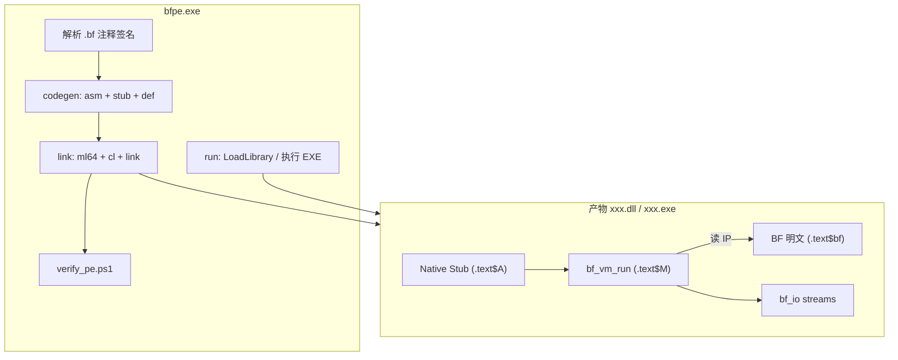

# BFPE 项目可行性报告

> 项目代号：BFPE（Brainfuck-in-PE，工程化）  
> 日期：2026-06-25  
> 状态：**可行**，基于 reference 子模块已验证的「第三种 DLL」实验结论  
> 参考实现：[reference/Brainfuck-in-PE](../reference/Brainfuck-in-PE/)

---

## 1. 项目目标

将 reference 实验（Brainfuck-in-PE）**产品化**为可独立使用的工具链 **bfpe**，满足：

| # | 需求 | 摘要 |
|---|------|------|
| R1 | **输入/输出流** | BF 的 `,` / `.` 对接可配置的输入/输出流（stdin/stdout、回调、内存缓冲） |
| R2 | **一文件一函数** | 每个 `.bf` 表示一个函数体；函数名、参数、返回值由文件头部注释声明 |
| R3 | **命令行工具** | `bfpe.exe` 将 BF 作为指令集写入 `.dll` / `.exe`，并支持带参调用 |
| R4 | **合规 PE** | 产物不得为「欺骗 DLL」或「伪装 DLL」；继承 reference 五项硬性约束 |

**一句话定义：**

> **bfpe** 是 Brainfuck 的 PE 后端：`.bf` 源文件经工具链嵌入 `.text` 明文，链接为合法 Windows DLL/EXE；运行时由 Stub + VM 解释执行，构建与验收流程自动排除欺骗/伪装形态。

---

## 2. 可行性结论

**结论：四项需求均可行；R4 在 reference 已验证的技术路径上可机械继承。**

| 需求 | 结论 | 依据 |
|------|------|------|
| R1 输入/输出流 | ✅ 可行 | reference 已有输出缓冲 + `BF_SetOutputCallback`；输入侧仅需对称扩展 |
| R2 注释签名 | ✅ 可行 | reference 已有 `; bfdll: export=output` 指令；扩展为完整签名 DSL 是自然演进 |
| R3 命令行 | ✅ 可行 | `bf2asm.py` + CMake 链接链可封装为 `bfpe build`；`LoadLibrary` / 静态入口可封装为 `bfpe run` |
| R4 合规 PE | ✅ 可行 | reference Phase 0–3 已通过 `verify_dll.ps1` 与多宿主验收 |

**整体风险等级：低～中。** 主要增量工作在于 I/O 流抽象、签名解析、EXE 入口与 CLI 编排；PE 合规核心路径无需重新发明。

---

## 3. 与 reference 的关系

```
reference/Brainfuck-in-PE     ←  实验验证（第三种 DLL，CMake 工程内嵌）
         │
         │  继承：VM、MASM 嵌入、BFC-0、verify 脚本、五项约束
         ▼
bfpe/                         ←  工程化（独立 CLI、签名 DSL、I/O 流、DLL+EXE）
```

reference 已证明：

- BF 明文经 MASM `db` 写入 `.text`（`/MERGE:bf_text=.text`）
- Windows 加载器识别为合法 DLL，`LoadLibrary` / 导入库可用
- 业务逻辑 100% 由 VM 解释 `.text` 内 ASCII 指令流
- 自动化脚本可检测 BF 是否在 `.rdata`、是否被资源隐藏

bfpe 在此基础上**不改变 PE 语义**，只增加工具面与运行时 I/O/签名能力。

---

## 4. 需求逐项分析

### 4.1 R1：输入/输出流

#### 4.1.1 现状（reference）

| 指令 | 当前行为 | 缺口 |
|------|----------|------|
| `.` | 写入 thread-local 4KB 缓冲；可选 `BF_SetOutputCallback` | 无统一「流」抽象；CLI 未接 stdout |
| `,` | `bf_io_read()` **固定返回 0** | 无法交互式输入 |

#### 4.1.2 目标设计

引入 **BF I/O 流接口**（C 层，供 VM 与 CLI 共用）：

```c
typedef struct bf_stream bf_stream_t;

typedef size_t (*bf_stream_read_fn)(bf_stream_t* s, uint8_t* buf, size_t cap, void* user);
typedef size_t (*bf_stream_write_fn)(bf_stream_t* s, const uint8_t* buf, size_t len, void* user);

/* VM 层：',' 从 input 读 1 字节（EOF → 0）；'.' 向 output 写 1 字节 */
void bf_io_bind_streams(bf_stream_t* in, bf_stream_t* out);
```

**预置后端：**

| 后端 | 用途 | 实现 |
|------|------|------|
| `stdio` | CLI `bfpe run` | `,` ← `_read(0,...)` / `getchar`；`.` → `fputc` / `_write(1,...)` |
| `buffer` | DLL 导出返回字符串 | 现有 `g_output_buffer` 逻辑 |
| `callback` | 宿主嵌入 | 现有 `BF_SetOutputCallback` + 新增 `BF_SetInputCallback` |
| `none` | 无输入 | `,` 恒 0（兼容 reference 行为） |

#### 4.1.3 可行性

- VM 已在 `bf_io_read` / `bf_io_write` 集中 I/O，**改动面小**
- Windows 控制台 I/O 与 `_declspec(dllexport)` 导出不冲突
- 线程局部 stream 绑定与现有 TLS 输出缓冲一致，DLL 多线程调用安全

**风险：** 阻塞式 stdin 在 GUI 宿主中需文档说明；MVP 可限定 CLI 为 CONSOLE 子系统。

---

### 4.2 R2：一 `.bf` 一函数，签名来自注释

#### 4.2.1 签名 DSL（草案）

在 `.bf` 头部用 `;` 注释声明元数据（与 BF 语法不冲突）：

```bf
; bfpe: export=Add
; bfpe: int add(int a, int b)
>[-<+>]
```

```bf
; bfpe: export=Hello
; bfpe: const char* hello(void)
; bfpe: io=stdio
++++++++[>++++[>++>+++>+++>+<<<<-]>+>+>->>+[<]<-]>>.>---.+++++++..+++.>>.<-.<.+++.------.--------.>>+.>++.
```

**指令集：**

| 指令 | 含义 | 示例 |
|------|------|------|
| `bfpe: export=<Name>` | 导出符号名（DLL）或入口逻辑名（EXE） | `export=Add` → `BF_Add` |
| `bfpe: <ret> <name>(<params>)` | C 风格签名（解析用） | `int add(int a, int b)` |
| `bfpe: io=<mode>` | 默认 I/O 模式 | `stdio` / `buffer` / `none` |
| `bfpe: entry` | 标记 EXE 入口（仅单文件 EXE） | 可选 |

**与 reference 兼容：** `; bfdll: export=output` 视为 `const char* name(void)` + `io=buffer` 的简写。

#### 4.2.2 代码生成

`bfpe compile`（由原 `bf2asm.py` 演进）根据签名自动生成：

1. **MASM** — `BF_Prog_<Name> LABEL BYTE` + `db '...'`（唯一合法的 BF 嵌入路径）
2. **Stub** — 参数写入 `tape[0..n-1]`，调用 `bf_vm_run`，按返回类型读 `tape[0]` 或 output buffer
3. **`.def`** — DLL 导出表项
4. **宿主头文件** — `bfpe_exports.h` 供 C/C# P/Invoke

#### 4.2.3 调用约定（BFC-0，继承 reference）

```
BFC-0（x64 Windows）
────────────────────
调用约定：__cdecl
参数：    第 i 个整型参数 → tape[i]（uint8_t 截断）
字符串返回：'.' 输出写入 buffer，export 返回 trim 后 const char*
整型返回：执行后 tape[0] 零扩展为 int
终止：    IP 遇 '\0'
```

MVP 签名类型建议限定为：

- `void`
- `int` / `int name(int, ...)`
- `const char*`（无参，纯输出型）

后续可扩展 `BFC-1`（32-bit cell）而不破坏 PE 布局。

#### 4.2.4 可行性

- reference 中 `BF_Add`（手写 Stub）与 `BF_AutoMessage`（自动生成）已覆盖「有参 int」与「无参 string」两类
- 签名解析可用正则 + 小型递归下降，Python 实现成本低
- **一文件一函数** 降低链接复杂度；多函数 DLL 可通过 `bfpe build a.bf b.bf -o lib.dll` 批量合并

---

### 4.3 R3：命令行 `bfpe.exe`

#### 4.3.1 命令形态

用户期望的简写：

```text
bfpe.exe <xxx.bf> <参数...> <xxx.dll|xxx.exe>
```

建议解析规则（避免歧义）：

| 场景 | 命令 | 行为 |
|------|------|------|
| **构建** | `bfpe build add.bf -o add.dll` | 编译 BF → 链接生成 PE |
| **构建（简写）** | `bfpe add.bf -o add.dll` | 同上 |
| **运行** | `bfpe run add.dll Add 3 5` | `LoadLibrary` → `BF_Add(3,5)` → 打印返回值 |
| **运行（简写）** | `bfpe add.bf 3 5 add.dll` | 若末尾为已存在 PE 且前面为字面量参数 → 按 `add.bf` 内签名调用对应导出 |
| **解释执行** | `bfpe exec add.bf 3 5` | 不写 PE，内存 VM + stdio（开发调试用，**非**第三种 DLL 产物） |

**写入 PE 的核心路径（第三种 DLL/EXE）：**

```
xxx.bf
  → bfpe 解析签名 + strip BF
  → 生成 gen/*.asm（MASM db）
  → ml64 + 编译 runtime（vm, io, stub）
  → link → xxx.dll / xxx.exe
  → verify_pe.ps1 自动验收
```

#### 4.3.2 DLL vs EXE

| 产物 | PE 特征 | 入口 | BF 位置 |
|------|---------|------|---------|
| `.dll` | `IMAGE_FILE_DLL` + 导出表 | EAT → Native Stub | `.text` Region B |
| `.exe` | 可执行文件 + 可选导出 | `main` / `WinMain` → Stub | 同上 |

EXE 与 DLL **共享同一 `.text` 布局**；差异仅在链接器 `/SUBSYSTEM`、入口符号与是否生成 `.def`。  
EXE 可在 `main` 中解析 `argv`，将参数写入 tape 后跑 BF，或将 CLI 子命令 `run` 内嵌进自身（自宿主 EXE）。

#### 4.3.3 实现架构

```
bfpe.exe（Python 或 C++ 驱动，MVP 推荐 Python + 调用 MSVC 工具链）
├── parse/          # .bf 注释 + 签名
├── codegen/        # asm / stub.c / .def 生成
├── link/           # 调用 ml64, cl, link（或 CMake 单次配置）
├── run/            # LoadLibrary / CreateProcess 调用
└── verify/         # 包装 verify_pe.ps1
```

**不推荐** 对已有第三方 PE 做二进制 patch 嵌入 BF（易破坏重定位/签名/节对齐，且难保证五项约束）。  
**推荐** 每次 `build` 从 runtime 模板完整链接，与 reference 一致。

#### 4.3.4 可行性

- reference 的 CMake 自定义命令已演示完整链路；bfpe 将其改为「单命令、单 `.bf` 输入、指定 `-o`」
- Python 调用 MSVC 是成熟方案（bfpe 自身不嵌入 BF 业务逻辑，不构成「欺骗」）
- `bfpe run` 等价于 reference 的 `test_host.exe`，实现量小

---

### 4.4 R4：禁止欺骗 DLL 与伪装 DLL

#### 4.4.1 定义（继承 reference）

| 类型 | 定义 | bfpe 对策 |
|------|------|-----------|
| **欺骗 DLL** | BF 预编译/JIT 为机器码作为业务逻辑 | 唯一执行路径：`bf_vm_run` 读 `.text` 指针；构建脚本 grep 禁止 AOT |
| **伪装 DLL** | BF 藏在 `.rsrc`、`.rdata`、外部文件 | BF **仅**经 MASM `db` 进 `.text`；C 源禁止 BF 字符串字面量 |

#### 4.4.2 硬性约束清单（构建时强制）

| # | 约束 | 验收 |
|---|------|------|
| C1 | 产物为合法 PE（DLL 或 EXE） | PE 头检查 |
| C2 | 可被正常加载/运行 | `LoadLibrary` 或执行 EXE |
| C3 | 非欺骗 | `.text` 内可见 `+-<>[],.` ASCII；无 BF→机器码 |
| C4 | 非伪装 | BF 不在 `.rdata` / 大 `.rsrc` |
| C5 | BF 在代码节 | 片段偏移落在 `.text` FileOffset 范围 |

#### 4.4.3 自动化保障

每次 `bfpe build` 末尾**必须**运行 `verify_pe.ps1`（由 reference `verify_dll.ps1` 泛化）：

- 支持 DLL 与 EXE（EXE 无导出表时跳过 EAT 检查）
- 读取构建 manifest，对每个输入 `.bf` 的 strip 后核心串做 `.text` 命中测试
- 静态检查：`runtime/`、`vm/` 下无 BF 指令字面量

**失败即非零退出码，不安装/不发布产物。**

#### 4.4.4 可行性

reference 已跑通全部检查项；bfpe 仅需参数化「期望导出符号」与「BF 片段列表」，**无技术障碍**。

---

## 5. 总体架构



**运行时数据流（带参调用）：**

```
bfpe run add.dll Add 3 5
    → GetProcAddress(BF_Add)
    → Stub: tape[0]=3, tape[1]=5
    → bf_vm_run(BF_Prog_Add)
    → VM 顺序读 .text 内 "[->+<]" 等价字节
    → 返回 tape[0] → 打印 8
```

---

## 6. 关键风险与对策

| 风险 | 影响 | 对策 |
|------|------|------|
| MSVC/MASM 工具链依赖 | Windows 外难以构建 | 文档明确 VS 2022 + x64；CI 用 windows-latest |
| C 字符串误入 `.rdata` | 伪装 DLL | codegen 禁止清单 + verify 扫 `.rdata` |
| CLI 参数与输出路径歧义 | 用户误用 | 文档 + `bfpe build`/`run` 子命令；简写规则固定「末参数为 PE 路径」 |
| 8-bit cell 溢出 | 计算错误 | BFC-0 文档化；签名解析器可选范围警告 |
| EXE 入口 vs DLL 导出 | 实现分叉 | 共享 runtime 静态库，仅链接脚本不同 |
| 输入阻塞 | GUI 宿主死锁 | 默认 `io=buffer`；`io=stdio` 仅 CLI 文档推荐 |
| 多 `.bf` 单 PE 符号冲突 | 链接失败 | export 名唯一性检查 |

---

## 7. 已知限制（MVP 预期）

| 限制 | 说明 |
|------|------|
| 架构 | 先 x64，x86 暂缓（与 reference 一致） |
| 签名类型 | MVP：`void` / `int` / `const char*`；无 struct/指针参数 |
| cell 宽度 | BFC-0：8-bit wrap |
| 工具链 | 需本机 Visual Studio（ml64, cl, link） |
| PE patch | 不支持向任意第三方 DLL 注入 BF |
| Authenticode | 本地构建无数字签名 |

---

## 8. 实施路线

| 阶段 | 内容 | 产出 |
|------|------|------|
| **Phase 0** | 从 reference 提取 runtime + verify；`bfpe build one.bf -o out.dll` | 最小可构建 DLL |
| **Phase 1** | 签名 DSL 解析 + 自动生成 Stub/def；I/O 流（stdio + buffer + callback） | 注释驱动导出 |
| **Phase 2** | `bfpe run`；简写 CLI；`verify_pe` 泛化支持 EXE | 完整 build/run 闭环 |
| **Phase 3** | 多文件合并单 DLL；`bfpe exec` 调试模式；文档与示例 | 工程化完成 |

---

## 9. 结论

**BFPE 项目化在技术上完全可行。**

- **R1～R3** 均为 reference 已验证架构的直线扩展，无原理性障碍  
- **R4** 通过继承 MASM 嵌入 + VM 唯一执行路径 + 构建后强制 verify，可系统性排除欺骗/伪装 DLL  
- 建议采用「完整链接生成 PE」而非「patch 现有 PE」，以保证节区语义与可验收性  

下一步：按 Phase 0 从 reference 提取 runtime，实现 `bfpe build` 与签名 DSL 解析器。

---

## 10. 参考

- [reference/Brainfuck-in-PE/docs/实验报告.md](../reference/Brainfuck-in-PE/docs/实验报告.md)
- [reference/Brainfuck-in-PE/docs/实现方案.md](../reference/Brainfuck-in-PE/docs/实现方案.md)
- [Microsoft PE Format](https://learn.microsoft.com/en-us/windows/win32/debug/pe-format)
